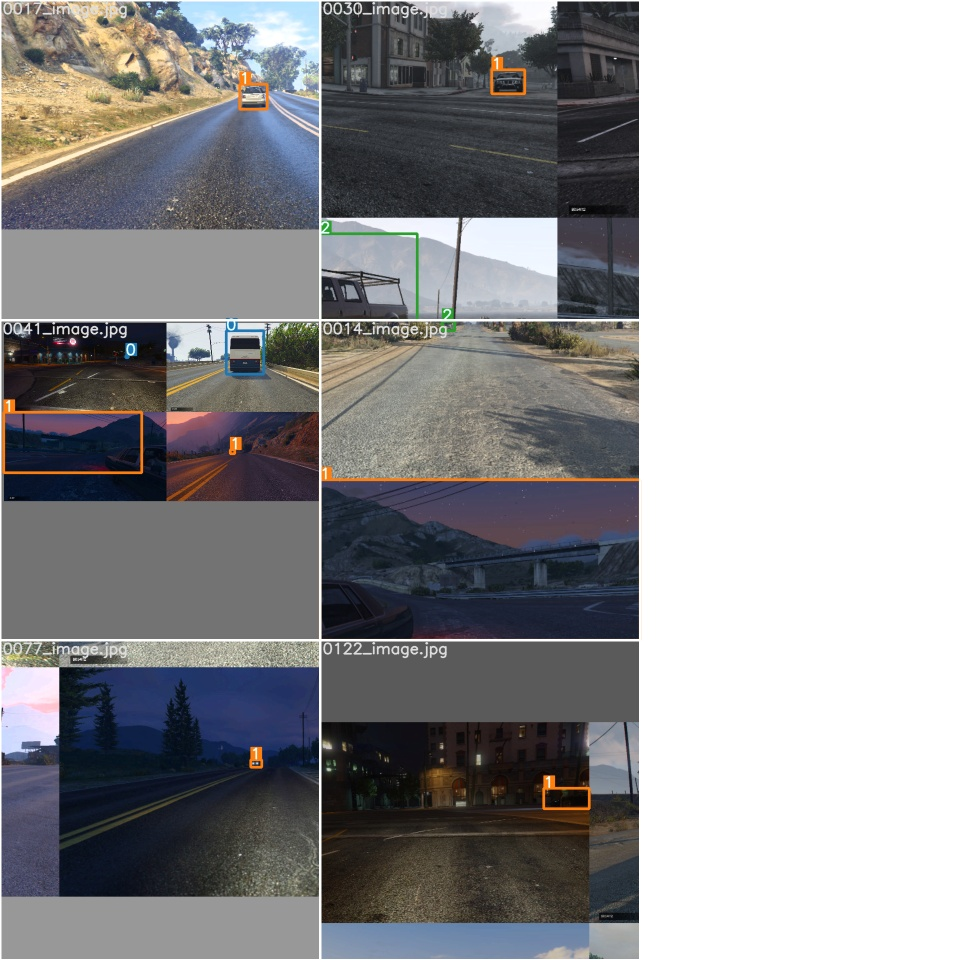

[//]: # (## This repository contains code for <a href="https://medium.com/@mihir_rajput/yolo-v5-is-here-custom-object-detection-tutorial-with-yolo-v5-12666ee1774e">this</a> tutorial.)
## Environment Setup:
1. Use Ubuntu18.04
2. Recommend to use conda environment, which provides useful package and virtual 
environment tools to help us setup the working environment
3. Create a python virtual environment and install required package:
```bash
conda create -n rob535 python=3.9
conda activate rob535
pip install -r requirements.txt
```

## Data preprocess
1. Put `test` and `trainval` folders from data folder to this github repo data folder 
2. run the following command line code to extract path and bounding box inforamtion from 
data set.  
```bash
python3 utils/carDataset.py [path-to-data-folder]
# for example, in my environment:
python3 utils/carDataset.py /home/ruijie/Desktop/rob535_perception_yolov5/data
```
## the command used in training and testing step.
1. training
2. After get a good model from training. We will use detect.py to predict the test image.
the weights parameter are stores in weights folder, we should use weights/best.pt.
3. we also saved previous good models in `trained_model` folder
```bash
python3 train.py --img 640 --batch 6 --epochs 500 --data ./data/car.yaml --cfg ./models/yolov5s.yaml --weights '' --device 0
# both of following are good
python3 detect.py --source test_img/  --weights weights/best.pt --conf 0.5
python3 detect.py --source test_img/  --weights /trained_model/weights_car7/best.pt --conf 0.5
```

## Command to generate output
The script will create a file called submission in the root of this repo. It is enough to
upload this file.
```bash
python auto_run_test.py
```
### Specific format of annotation
* `<object-class>` - integer number of object from `0` to `(classes-1)`
* `<x> <y> <width> <height>` - float values relative to width and height of image, it can be equal from (0.0 to 1.0]
* for example: `<x> = <absolute_x> / <image_width>` or `<height> = <absolute_height> / <image_height>`
atention: `<x> <y>` - are center of rectangle (are not top-left corner)
* [Specific format of annotation](https://github.com/AlexeyAB/Yolo_mark/issues/60)

## Model Training Matrix
<p align="center">
  
</p>

## Output
<p align="center">
  
</p>

[//]: # (## Licence)

[//]: # ([![License: GPL v3]&#40;https://img.shields.io/badge/License-GPLv3-blue.svg&#41;]&#40;https://www.gnu.org/licenses/gpl-3.0&#41;)

[//]: # ()
[//]: # (## Credits)

[//]: # (https://ultralytics.com/ <br/>)

[//]: # (https://roboflow.ai/)
