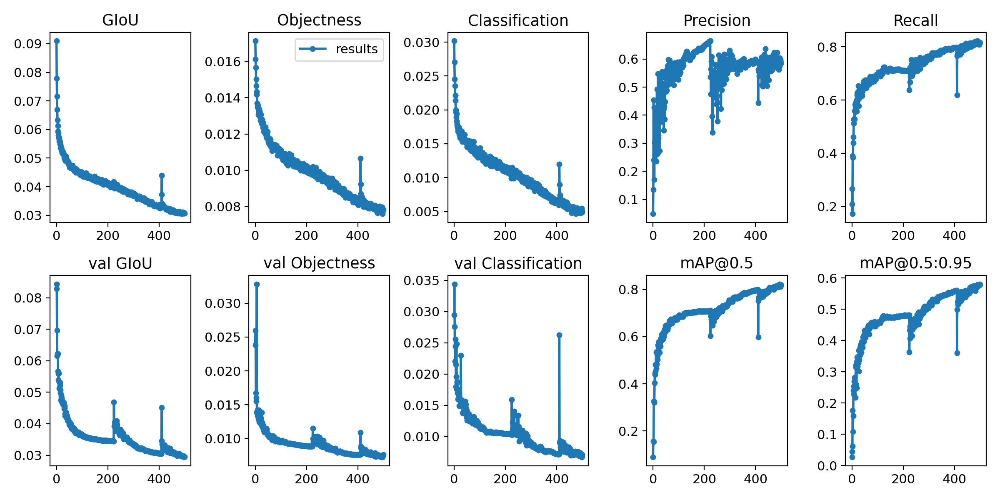
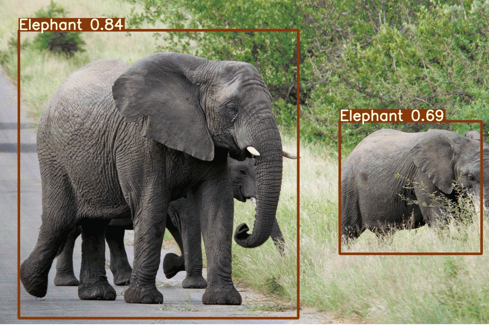

## This repository contains code for <a href="https://medium.com/@mihir_rajput/yolo-v5-is-here-custom-object-detection-tutorial-with-yolo-v5-12666ee1774e">this</a> tutorial.
```bash
python train.py --img 640 --batch 6 --epochs 200 --data ./data/car.yaml --cfg ./models/yolov5s.yaml --weights '' --device 0
python detect.py --source test_img/  --weights trained_model/weights_car3/best.pt --conf 0.2
```
### Specific format of annotation
* `<object-class>` - integer number of object from `0` to `(classes-1)`
* `<x> <y> <width> <height>` - float values relative to width and height of image, it can be equal from (0.0 to 1.0]
* for example: `<x> = <absolute_x> / <image_width>` or `<height> = <absolute_height> / <image_height>`
atention: `<x> <y>` - are center of rectangle (are not top-left corner)
* [Specific format of annotation](https://github.com/AlexeyAB/Yolo_mark/issues/60)

## Model Training Matrix
<p align="center">
  
</p>

## Output
<p align="center">
  
</p>

## Licence
[](https://www.gnu.org/licenses/gpl-3.0)

## Credits
https://ultralytics.com/ <br/>
https://roboflow.ai/
